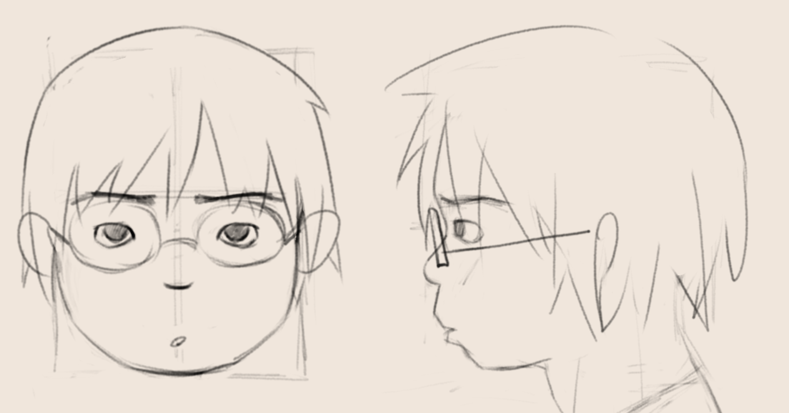
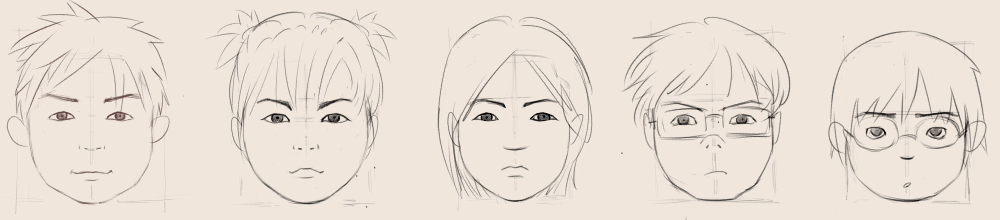

<figure style="text-align: center;">
  
  <figcaption>杨朔像</figcaption>
</figure>
杨朔开智以后就变得沉默了。母亲包办了他生活与学习中的一切，在初中旁边租了个小单间监督他。同学说他妈宝男，对于一个没有俄狄浦斯情结的崭新小登来说，十分震撼。

杨朔母亲素与家族里不和，杨朔父亲常年在外打工，入赘杨家，妻子面前也是毫无话语权，就此来看目前没人劝得了他母亲。恰逢杨朔的姐姐杨月毕业工作了，再没人给他分担火力，杨朔的成绩一落千丈。

回山上过年的时候，杨朔很是羡慕他的兄姐：舅舅家的杨剑一，杨超兰，俨然已是一家之主，谈笑自若；小姨家的杨林比他大个几岁，却已考入名校；亲姐姐杨月早就置身世外，和超兰姐住在一起了。

山上的空气很清晰，阳光晒得黄土地暖烘烘的，总能让杨朔忘掉县里那个拥挤嘈杂又乌烟瘴气的出租屋，忘掉作文写到自己父母的尴尬。杨朔没事就爬到阁楼上看杨林弄电脑，杨朔母亲总是要杨朔去做题，发现杨朔在阁楼上便要顺着梯子爬上来。后来杨林看到杨朔上来之后就干脆把梯子收了上来，无计可施的杨朔母亲气得不行，抄起棍子要打杨朔，众人好不容易才劝住。

杨朔母亲知道了杨林在读计算机专业，斥巨资给杨朔安排了个编程兴趣班，买了一台电脑，打工的杨朔父亲颇有微词。虽说周末已经快被兴趣班填满了，但这一次杨朔却兴致盎然，他窥见了一种深不可测的事物：圈子。

圈子里人互称神，总有神抛出各种陌生的概念，拿着代码在电脑上跑出神奇的东西来，完全超越了编程老师课上教授的内容，杨朔很好奇神是如何知道这些东西的。杨林听说了这事，劝杨朔别花这冤枉钱了，网上有免费的资源。虽然这不能改变杨朔母亲的想法，但后来杨林给了杨朔梯子，杨朔也算是成为杨神了。

杨朔成绩眼看着够不着县里好的那个高中的线了，母亲停了他的编程兴趣班。可杨朔此时哪里管的上什么这个高中那个高中，他已然成为班上 Minecraft 的大手子，尽管同学们晚上在宿舍里玩了什么他一概不知，但第二天所有人都得请教他命令方块里的代码怎么写。

有一天杨朔洗脚的时候母亲倒开水意外烫伤了杨朔的右手，学校里只能艰难的用左手做笔记，同桌周游看他做的笔记实在难以辨认，便帮他做笔记，一来二去两人就熟络了。周游喜欢顺手在杨朔书上画一些二次元人物，杨朔看着觉得和编程圈子里的那些神的头像颇为相似，便向周游请教。渐渐的，杨朔意识到这个社会就是由各式各样的圈子组成的。

杨朔的右手好了以后，周游就教他画画。周游喜欢画的那些角色杨朔并不认识，杨朔喜欢画画杨月姐，超兰姐，画画班上的同学，他开始期待起每天的上学生活。

周游也不住校，放学后杨朔并不想立刻回家，时常和周游逛到红军广场聊天。广场对岸，诺水河的浪花拍打着璧山的岩壁。

说起县里两所高中，好的那所去年出了十几个清华北大。杨朔觉得不可思议，杨林哥在成都读的高中，也没几个清华北大啊。周游分析，这儿是革命老区，又是贫困县，有几十分的加分，前途可期啊。杨朔听了有些浮躁，他自知什么清华北大不是自己的事，他目前最大的愿望就是继续和周游一起画画。

可惜事与愿违，杨朔的母亲为了确保杨朔考上好的那所高中，给杨朔办了休学。于此同时给杨朔报了各个学科的培训班，杨朔父亲实在是拿不出这多钱，杨朔母亲便向杨月要，家族里的人听说了都以为不妥。

这段时间杨朔可谓陷入了人生低谷。他尝试着像任何一个青春期少年一样与父母闹一闹，但在母亲面前被严酷地镇压了。杨朔天天关在阴暗的出租屋里，脸都养白了，只能天天上社交媒体和朋友贴贴。周游推了刘统的《北上》给杨朔，杨朔此时却兴趣寥寥。偶然借着梯子上推看了看世界，杨朔朴素的人生观受到了极大的冲击，一时间这样的生活好像也不是不可以接受了。

婆婆在峨眉山的小姨家养病，年底的时候，婆婆的身体状况告急，杨朔母亲分外焦急，带着杨朔赶到了峨眉山。此时舅舅和杨剑一，小姨和杨林都在，大人们对于接下来该如何处理，接婆婆回山上叶落归根，还是送到医院搏一搏，争论不休，杨林和杨朔便出去闲逛。

杨林听说杨朔在学习上遇到些困难，颇为不解，杨朔自幼便是聪明伶俐，如此这般只能是心里有难以为之奋斗的愿望。听杨朔说起来画画，便询问他是不是想走美术高考，现在开始准备还来得及。杨朔回想起在杨林家看到的素描，寻思也不是想画素描，正巧路过罗森联动非人哉，便指着说画的是这种东西。杨林笑笑说当然知道你画的是什么，但是这都需要打基础才能画好的，你要想走这条路还得去集训嘞。杨林越听越迷糊，觉得事情早已超过他和周游画画这么简单了。

平羌江水泛起雾霭，湿冷的山风吹得杨朔瑟瑟发抖。杨林尝试了种种猜测，杨朔是不是谈恋爱了，是不是沉迷游戏，是不是想当女孩，但杨朔却沉默了。

晚上回家，众人一致决定送婆婆回山上，唯独杨朔母亲仍然反对，闹得气氛很不愉快。见杨林和杨朔回来了，便问杨朔从杨林哥上学到东西没有，杨林见杨朔母亲咄咄逼人，索性拉来一起谈心，想找到杨朔的愿望究竟是什么。灯光下，杨朔沉思良久，试探地说他想去做游戏，看了一眼母亲，旋即又补充上如果能进腾讯这样的公司会有非常多的钱，眼神一转，又叹气说他肯定是做不到的。杨林释怀地笑了，说这就是他的老本行啊，他还在腾讯实习过呢，现在好好学数学英语，有什么做不到。杨朔母亲听杨林说要去云南采风，便邀请杨林去杨朔家辅导辅导杨朔，在大巴山采风也是采风嘛，杨林尴尬地拒绝了，却对杨朔母亲的行为留下了心。

婆婆最终被送回了山上，出乎意料的，婆婆的身体状况好转了。杨林想起杨朔母亲的行为，在网上问杨朔为什么想做游戏，杨朔说，他想创建一个虚拟世界，在哪里没有出租屋，没有家长，没有尴尬的人际关系，只有二次元形象的好朋友们贴贴，就像在 Minecraft 里一样。杨林知道杨朔步上了他的老路，他必须告诉杨朔，虚拟世界的慰藉，仍然是虚拟的。

杨林建议杨朔读读历史。杨朔看到周游推的《北上》，原来四方面军的娃娃兵才自己的年龄，就已血洒战场，远赴他乡。过年的时候，杨朔搭超兰姐的车去巴中接杨朔父亲，注意到沿途兴建起的红色文化主题高速，漫山遍野的红叶，无数无名的五角星，感慨良多。

年夜饭上，杨朔母亲硬要给婆婆喂他从镇上带来的羊肉，主管婆婆食物的舅妈不许，杨朔母亲便闹了起来，气氛剑拔弩张。杨朔突然起身向母亲进一杯酒，用生疏的声音劝母亲说一家人要包容理解，众人无不刮目相看。杨朔母亲似乎受了很大触动，一个人到屋外去了。舅舅郑重地表扬了杨朔的勇气，为家付出的努力，让大家学习。杨月向杨朔竖了大拇指，起身去屋外看母亲，母亲正蹲在墙角低声啜泣，杨月赶紧把杨朔也叫了出来。

杨月悄悄告诉杨朔，母亲从小不受家里人待见，唯有婆婆对他永远慈爱，母亲内心深处一直不服，希望婆婆告诉所有人他值得被爱。杨朔摇摇晃晃地躺到坝子上，泥土里还残留着些许阳光的温度，山风吹过他涨红的脸，冷飕飕的。

尽管有些小不愉快，过年的活动一定不能少。剑一哥搬来半人高的音响，一家人的歌声回响山谷；对面山一家人来向超兰姐提亲，超兰姐熬了一大锅醪糟；杨月姐编排舞蹈，杨林哥放鞭炮，这样的日子能一直过下去就好了。

大年初六，剑一哥得动身去湖南打工了，舅妈提了一大袋腊肉交给他，让他分给老板说这是四川娃子的带来的特产。接着超兰姐和杨月姐也要开车回成都了。杨林也回家学习去了。众人临走前，婆婆叫舅舅从箱子里取来五枚毛主席像章，亲手交给了杨剑一，杨超兰，杨月，杨林，杨朔。杨朔托着婆婆的手，婆婆看着杨朔，蠕动的嘴说不出一个字来。杨朔也该回县里了，舅舅骑着摩托送他回去。蜿蜒的山路旁是峭壁，汹涌的通江上是大桥，杨朔，你心里的愿望，现在是什么呢？
<figure style="text-align: center;">
  
  <figcaption>兄弟姐妹五人</figcaption>
</figure>
